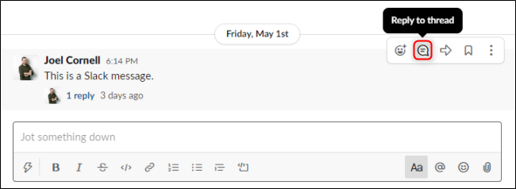

## Slack

- Please fill out your Slack Profile, Status and upload a picture.
- Treat Slack as you treat email: read often, and reply often (we recommend once a day, at least)
- Engage in conversation, reply to questions, even if only by selecting an emoji reaction to the messages. This goes a long way to show people are listening!
- Do not be afraid to post questions, interesting links, or anything you may judge of general interest to the community
- Answer in threads, which makes the discussion easier to follow and more focused.

