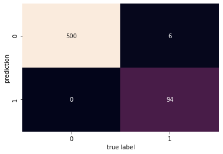

# Naive Bayes

Naive Bayes models are a group of very fast and relatively simple algorithms used for classification. They are often very suitable for data with high dimentionality.
They have very few hyperparameters and can be a great choice for a MVP or baseline model.

We will introduce you to Gaussian Naive Bayes and Multinomial Naive Bayes.

The following Videos explain how the algorithms work. Below you will find a short practical example of Spam Detection using Multinomial Naive Bayes.

[Multinomial Naive Bayes](https://www.youtube.com/watch?v=O2L2Uv9pdDA)

[Gaussian Naive Bayes](https://www.youtube.com/watch?v=H3EjCKtlVog)


## Possible Practical Example Multinomial Bayes: Spam Detection

Use this easy to handle dataset for quick example: [Spam Dataset](https://www.kaggle.com/ozlerhakan/spam-or-not-spam-dataset)


```python
import pandas as pd
import seaborn as sns
import matplotlib.pyplot as plt
from sklearn.model_selection import StratifiedShuffleSplit
from sklearn.feature_extraction.text import CountVectorizer
from sklearn.naive_bayes import MultinomialNB
from sklearn.pipeline import make_pipeline
from sklearn.metrics import accuracy_score, confusion_matrix, recall_score, precision_score
```


```python
spam_data = pd.read_csv("D:/datasets/tabular/spam/spam_or_not_spam.csv")
spam_data
```


<div>
<style scoped>
    .dataframe tbody tr th:only-of-type {
        vertical-align: middle;
    }

    .dataframe tbody tr th {
        vertical-align: top;
    }

    .dataframe thead th {
        text-align: right;
    }
</style>
<table border="1" class="dataframe">
  <thead>
    <tr style="text-align: right;">
      <th></th>
      <th>email</th>
      <th>label</th>
    </tr>
  </thead>
  <tbody>
    <tr>
      <th>0</th>
      <td>date wed NUMBER aug NUMBER NUMBER NUMBER NUMB...</td>
      <td>0</td>
    </tr>
    <tr>
      <th>1</th>
      <td>martin a posted tassos papadopoulos the greek ...</td>
      <td>0</td>
    </tr>
    <tr>
      <th>2</th>
      <td>man threatens explosion in moscow thursday aug...</td>
      <td>0</td>
    </tr>
    <tr>
      <th>3</th>
      <td>klez the virus that won t die already the most...</td>
      <td>0</td>
    </tr>
    <tr>
      <th>4</th>
      <td>in adding cream to spaghetti carbonara which ...</td>
      <td>0</td>
    </tr>
    <tr>
      <th>...</th>
      <td>...</td>
      <td>...</td>
    </tr>
    <tr>
      <th>2995</th>
      <td>abc s good morning america ranks it the NUMBE...</td>
      <td>1</td>
    </tr>
    <tr>
      <th>2996</th>
      <td>hyperlink hyperlink hyperlink let mortgage le...</td>
      <td>1</td>
    </tr>
    <tr>
      <th>2997</th>
      <td>thank you for shopping with us gifts for all ...</td>
      <td>1</td>
    </tr>
    <tr>
      <th>2998</th>
      <td>the famous ebay marketing e course learn to s...</td>
      <td>1</td>
    </tr>
    <tr>
      <th>2999</th>
      <td>hello this is chinese traditional 子 件 NUMBER世...</td>
      <td>1</td>
    </tr>
  </tbody>
</table>
<p>3000 rows × 2 columns</p>
</div>


```python
spam_data.info()
```

    <class 'pandas.core.frame.DataFrame'>
    RangeIndex: 3000 entries, 0 to 2999
    Data columns (total 2 columns):
     #   Column  Non-Null Count  Dtype 
    ---  ------  --------------  ----- 
     0   email   2999 non-null   object
     1   label   3000 non-null   int64 
    dtypes: int64(1), object(1)
    memory usage: 47.0+ KB
    


```python
spam_data.isna().sum()
```


    email    1
    label    0
    dtype: int64


```python
spam_data.dropna(inplace = True)
```


```python
spam_data.reset_index(inplace = True)
```


```python
spam_data["label"].value_counts()
```


    0    2500
    1     499
    Name: label, dtype: int64


As you can see (and as you would hope) Spam Mails are less common. The classes are very imbalanced with the ration being 5:1. This could cause issues with some classifiers and is something that can be addressed in different ways.
Fortunately the NB Classifier is relatively robust against these imbalances.

Let's split the data before we look at it further.


```python
X = spam_data["email"]
y = spam_data["label"]

splitter = StratifiedShuffleSplit(n_splits = 5,test_size=0.2, random_state=13)

for train_index, test_index in splitter.split(X,y):
    #print("train:", train_index, "test:", test_index)
    X_train, X_test = X[train_index], X[test_index]
    y_train, y_test = y[train_index], y[test_index]
```


```python
X_train
```


    762     on tue NUMBER sep NUMBER thosstew URL wrote kl...
    2968     private label reseller hosting plans starter ...
    1840    url URL date tue NUMBER sep NUMBER NUMBER NUMB...
    1411     yannick gingras wrote what do you mean by cd ...
    1651     dunno about the other tools but spamassassin ...
                                  ...                        
    308     on NUMBER aug NUMBER rosso wrote does anyone h...
    2141    url URL date NUMBER NUMBER NUMBERtNUMBER NUMBE...
    1221    once upon a time brian wrote yeah but i try to...
    942      begin forwarded message from ian andrew bell ...
    593     i d like to claim the parenthood of desktop we...
    Name: email, Length: 2399, dtype: object


```python
y_train
```


    762     0
    2968    1
    1840    0
    1411    0
    1651    0
           ..
    308     0
    2141    0
    1221    0
    942     0
    593     0
    Name: label, Length: 2399, dtype: int64


```python
X_test.shape, y_test.shape
```


    ((600,), (600,))


let's see an example of spam


```python
with pd.option_context('display.max_colwidth', None):
    print(X_train[y_train == 1].sample())
```

    2983    there is no stumbling on to it the greatest way of marketing this century is undoubtedly direct e mail it s similar to the postman delivering a letter to your mailbox the ability to promote your product service website or mlm network marketing opportunity to millions instantly is what advertisers have been dreaming of for over NUMBER years we e mail your one page promotion to a list of our general addresses the greatest part is it s completely affordable e mail marketing is the answer how do we know we know because that s exactly what we do it s a proven fact that you can attract new business through direct e mail marketing the profits that e mail advertising generate are amazing we are living proof we are a direct e mail internet advertising company and our clients pay us thousands of dollars a week to e mail their products and services we don t want any one spending thousands on a direct email marketing campane with out testing the market to see how it works standard pricing and procedures extracting our list of general internet addreses are actually extracted from the most popular web sites on the internet the addresses are verified and run through our purification process the process includes addresses run against our custom remove filter of NUMBER NUMBER keywords as well as through our NUMBERmb remove flamer list the edu org gov mil and us domains are removed as well as other domains that asked not to receive e mail evaluation NUMBER NUMBER optional one of our marketing specialists will evaluate your sales letter and offer his her expertise on how to make it the most successful standard pricing emails delivered NUMBER million NUMBER NUMBER per NUMBER million NUMBER NUMBER per NUMBER million NUMBER NUMBER per NUMBER million up NUMBER NUMBER per special offer this introductory offer of NUMBER NUMBER includes NUMBER set up fee NUMBER evaluation of sales letter NUMBER NUMBER NUMBER e mails delivered payment policy all services must be paid in full prior to delivery of advertisement notice absolutely no threatening or questionable materials if you are serious about direct email marketing fax the following to NUMBER NUMBER NUMBER please fill this form out completely contact name _____________________________________________ business name ______________________________________ years in business _________________________ business type ______________________________________ address _________________________________________________ city ____________________ state ______ zip ______________ country _______________ email address _______________________________________________ phone __________________________ fax _______________________ no toll free phone s to get out from our email database send an email to publicserviceNUMBER URL 
    Name: email, dtype: object
    

And one of no spam (ham)


```python
with pd.option_context('display.max_colwidth', None):
    print(X_train[y_train == 0].sample())
```

    2471     martin adamson martin srvNUMBER ems ed ac uk wrote two demonstrators heading to saturday s anti war march in san francisco were critically injured when their heads sticking through the roof of a former school bus hit the top of the broadway tunnel not quite so funny as they both subsequently died i think broadly i was trying to be both vulgar and ironic in a big city as small as san francisco there is as i believe i stated in the initial post maybe one place in the whole that they shoulda kept their heads inside they were told to they didn t and they got what was coming to them i ll feel bad about getting a sick chuckle out of it maybe when it happens to someone i know personally til then haw haw haw like the darwin awards get it sloanie __________________________________________________ do you yahoo yahoo mail plus powerful affordable sign up now URL to unsubscribe from this group send an email to forteana unsubscribe URL your use of yahoo groups is subject to URL 
    Name: email, dtype: object
    

Before we can use our NB Classifier we need to convert the long text strings into vectors of numbers.
We will use a TF-IDF vectorizer (Explain)
We will combine the vectorizer directly with our NB model and create a pipeline that does everything in one go.


```python
spam_model = make_pipeline(CountVectorizer(),MultinomialNB())
```


```python
spam_model.fit(X_train,y_train)
preds = spam_model.predict(X_test)
```

Let's see the accuracy.


```python
accuracy_score(y_test,preds)
```


    0.99


Remember accuracy is not always a good metric, **especially** when dealing with highly imbalanced classes.
Let's look at the confusion matrix to get a sense of the mistakes our model makes.
Think about which mistake would be more costly when it comes to spam classification.
Would we rather have a more cautios algorithm sometimes flagging a legit mail as spam or one that let's a couple of spam pass by?


```python
recall_score(y_test,preds)
```


    0.94


```python
precision_score(y_test,preds)
```


    1.0


```python
cm = confusion_matrix(y_test,preds)
sns.heatmap(cm.T, annot=True,fmt="d",cbar = False)
plt.xlabel("true label")
plt.ylabel("prediction")
plt.show()
```


    

    


Alright that doesn't look too bad. 
The Matrix shows us that we classify **all** the **Ham** messages correctly. 
We also classify most **Spam** Mail as such. There are still some slipping through which we don't really want but it's only 6%.
We achieved what we wanted almost no Spam being classified as a legit mail and established a very good baseline with realatively simple techniques.

Could we do better? Probably.
There are more advanced modeling techniques. There are also more advanced text processing techniques. The model was very quick to train, something that more complex NLP models will not permit. The boost in performance usually comes at a price in terms of computational resources. 
Even if you want to build more complex models,which we encourage you to do if you are interested (just reach out in Slack), you should start with a baseline such as this one and iterate from here.
